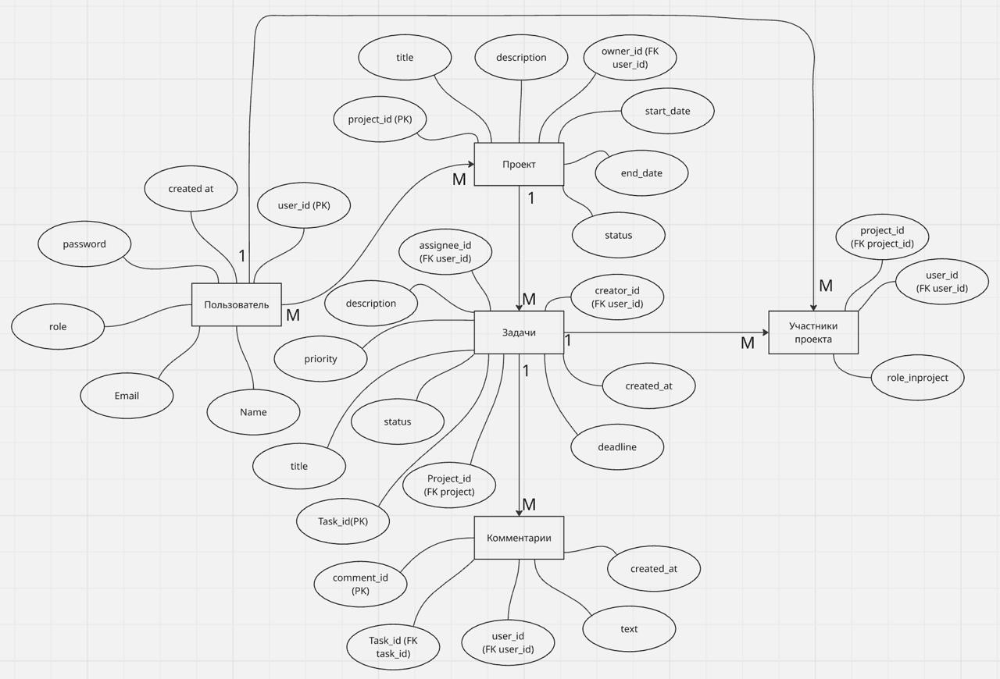

# Система управления задачами

Учебный проект по ООП: система управления проектами и задачами.

Проект предназначен для организации совместной работы команды: пользователи могут создавать проекты, добавлять участников, ставить задачи, назначать исполнителей, отслеживать статусы выполнения и оставлять комментарии.

---

## Этап 1. Проектирование доменной области

## 1. Описание предметной области

Проект представляет собой систему управления проектами и задачами.

Основная задача приложения - позволить пользователям создавать проекты, добавлять участников, распределять задачи между исполнителями, отслеживать статусы выполнения и обсуждать задачи через комментарии.

Система помогает команде видеть общий список задач, понимать, кто за что отвечает, какие задачи уже выполнены, а какие находятся в работе.

## 2. Бизнес-контекст

Команда работает над проектом и хочет удобно распределять задачи между участниками.

Например, пользователь создает проект "Проект по ООП", добавляет туда участников команды, создает задачу "Разработать API-контракты", назначает исполнителя и указывает срок выполнения.

После этого исполнитель может менять статус задачи, а остальные участники могут оставлять комментарии для обсуждения деталей.

## 3. Основные сценарии использования

### Use Case 1. Регистрация пользователя

**Актор:** Пользователь.

**Цель:** создать учетную запись в системе.

**Основной сценарий:**

1. Пользователь вводит имя, email и пароль.
2. Система проверяет корректность данных.
3. Система создает пользователя.
4. Пользователь получает доступ к системе.

**Результат:** пользователь зарегистрирован и может работать с проектами и задачами.

---

### Use Case 2. Авторизация пользователя

**Актор:** Пользователь.

**Цель:** войти в систему и получить доступ к своим проектам.

**Основной сценарий:**

1. Пользователь вводит email и пароль.
2. Система проверяет данные.
3. Если данные верны, система авторизует пользователя.
4. Пользователь получает доступ к проектам и задачам.

**Результат:** пользователь авторизован в системе.

---

### Use Case 3. Создание проекта

**Актор:** Пользователь.

**Цель:** создать новый проект для совместной работы.

**Основной сценарий:**

1. Пользователь вводит название, описание и сроки проекта.
2. Система проверяет корректность данных.
3. Система создает проект.
4. Пользователь становится владельцем проекта.

**Результат:** создан новый проект, доступный владельцу.

---

### Use Case 4. Редактирование проекта

**Актор:** Владелец проекта.

**Цель:** изменить данные существующего проекта.

**Основной сценарий:**

1. Владелец открывает проект.
2. Владелец изменяет название, описание, сроки или статус проекта.
3. Система проверяет корректность данных.
4. Система сохраняет изменения.

**Результат:** данные проекта обновлены.

---

### Use Case 5. Добавление участника в проект

**Актор:** Владелец проекта.

**Цель:** добавить пользователя в проект для совместной работы.

**Основной сценарий:**

1. Владелец проекта выбирает пользователя.
2. Владелец назначает роль внутри проекта.
3. Система добавляет пользователя в список участников.

**Результат:** пользователь становится участником проекта.

---

### Use Case 6. Удаление участника из проекта

**Актор:** Владелец проекта.

**Цель:** удалить пользователя из списка участников проекта.

**Основной сценарий:**

1. Владелец открывает список участников проекта.
2. Владелец выбирает участника.
3. Система проверяет, что удаляемый пользователь не является владельцем проекта.
4. Система удаляет пользователя из проекта.

**Результат:** пользователь больше не имеет доступа к проекту.

---

### Use Case 7. Создание задачи

**Актор:** Участник проекта.

**Цель:** создать задачу внутри проекта.

**Основной сценарий:**

1. Пользователь выбирает проект.
2. Пользователь вводит название, описание, приоритет и срок выполнения.
3. Пользователь назначает исполнителя.
4. Система проверяет, что исполнитель состоит в проекте.
5. Система создает задачу со статусом `NEW`.

**Результат:** в проекте создана новая задача.

---

### Use Case 8. Назначение исполнителя задачи

**Актор:** Участник проекта.

**Цель:** назначить или изменить исполнителя задачи.

**Основной сценарий:**

1. Пользователь выбирает задачу.
2. Пользователь выбирает нового исполнителя.
3. Система проверяет, что выбранный пользователь является участником проекта.
4. Система сохраняет нового исполнителя задачи.

**Результат:** у задачи назначен исполнитель.

---

### Use Case 9. Изменение статуса задачи

**Актор:** Исполнитель задачи.

**Цель:** обновить текущий статус выполнения задачи.

**Основной сценарий:**

1. Исполнитель открывает задачу.
2. Исполнитель выбирает новый статус.
3. Система проверяет допустимость статуса.
4. Система сохраняет новый статус задачи.

**Результат:** статус задачи обновлен.

---

### Use Case 10. Комментирование задачи

**Актор:** Участник проекта.

**Цель:** оставить комментарий к задаче для обсуждения работы.

**Основной сценарий:**

1. Пользователь открывает задачу.
2. Пользователь вводит текст комментария.
3. Система проверяет, что комментарий не пустой.
4. Система сохраняет комментарий.

**Результат:** комментарий добавлен к задаче.

---

## 4. Основные сущности

| Сущность      | Назначение                                |
| ------------- | ----------------------------------------- |
| User          | Пользователь системы                      |
| Project       | Проект, объединяющий задачи и участников  |
| ProjectMember | Участник проекта с ролью внутри проекта   |
| Task          | Задача, относящаяся к конкретному проекту |
| Comment       | Комментарий пользователя к задаче         |

---

## 5. Описание доменных моделей

## 5.1 User

| Поле      | Тип      | Описание                              |
| --------- | -------- | ------------------------------------- |
| userId    | int      | Уникальный идентификатор пользователя |
| name      | string   | Имя пользователя                      |
| email     | string   | Email пользователя                    |
| password  | string   | Пароль пользователя                   |
| role      | UserRole | Роль пользователя в системе           |
| createdAt | DateTime | Дата создания пользователя            |

---

## 5.2 Project

| Поле        | Тип           | Описание                         |
| ----------- | ------------- | -------------------------------- |
| projectId   | int           | Уникальный идентификатор проекта |
| title       | string        | Название проекта                 |
| description | string        | Описание проекта                 |
| ownerId     | int           | ID владельца проекта             |
| startDate   | Date          | Дата начала проекта              |
| endDate     | Date          | Дата окончания проекта           |
| status      | ProjectStatus | Статус проекта                   |

---

## 5.3 ProjectMember

| Поле          | Тип         | Описание                    |
| ------------- | ----------- | --------------------------- |
| projectId     | int         | ID проекта                  |
| userId        | int         | ID пользователя             |
| roleInProject | ProjectRole | Роль пользователя в проекте |

---

## 5.4 Task

| Поле        | Тип          | Описание                        |
| ----------- | ------------ | ------------------------------- |
| taskId      | int          | Уникальный идентификатор задачи |
| projectId   | int          | ID проекта                      |
| creatorId   | int          | ID автора задачи                |
| assigneeId  | int          | ID исполнителя задачи           |
| title       | string       | Название задачи                 |
| description | string       | Описание задачи                 |
| priority    | TaskPriority | Приоритет задачи                |
| status      | TaskStatus   | Статус задачи                   |
| deadline    | DateTime     | Срок выполнения                 |
| createdAt   | DateTime     | Дата создания задачи            |

---

## 5.5 Comment

| Поле      | Тип      | Описание                             |
| --------- | -------- | ------------------------------------ |
| commentId | int      | Уникальный идентификатор комментария |
| taskId    | int      | ID задачи                            |
| userId    | int      | ID автора комментария                |
| text      | string   | Текст комментария                    |
| createdAt | DateTime | Дата создания комментария            |

---

## 6. Связи между сущностями

| Связь               | Описание                                            |
| ------------------- | --------------------------------------------------- |
| User 1 -> N Project | Один пользователь может создать много проектов      |
| Project 1 -> N Task | Один проект может содержать много задач             |
| User 1 -> N Task    | Один пользователь может создавать и выполнять задачи |
| Project N -> M User | Проекты и пользователи связаны через ProjectMember  |
| Task 1 -> N Comment | Одна задача может иметь много комментариев          |

---

## 7. Ограничения

1. Email пользователя должен быть уникальным.
2. Пароль пользователя не может быть пустым.
3. Проект обязан иметь владельца.
4. Название проекта не может быть пустым.
5. Дата окончания проекта должна быть позже даты начала.
6. Задача должна принадлежать существующему проекту.
7. Название задачи не может быть пустым.
8. Исполнитель задачи должен быть участником проекта.
9. Комментарий не может быть пустым.
10. Проект нельзя удалить, если в нем есть незавершенные задачи.

---

## 8. Бизнес-правила

1. Каждый проект должен иметь владельца.
2. Создатель проекта автоматически становится его владельцем.
3. Владелец проекта автоматически добавляется в список участников проекта с ролью `OWNER`.
4. Один пользователь может участвовать в нескольких проектах.
5. В одном проекте может быть несколько участников.
6. Один и тот же пользователь не может быть добавлен в один проект два раза.
7. Пользователь может просматривать только те проекты, в которых он является участником.
8. Задача создается только внутри существующего проекта.
9. При создании задачи ей автоматически присваивается статус `NEW`.
10. Исполнителем задачи может быть только пользователь, который является участником проекта.
11. Статус задачи может принимать только значения `NEW`, `IN_PROGRESS`, `REVIEW`, `DONE`.
12. Приоритет задачи может принимать только значения `LOW`, `MEDIUM`, `HIGH`.
13. Дедлайн задачи не может быть раньше даты создания задачи.
14. Комментарий можно добавить только к существующей задаче.
15. Текст комментария не может быть пустым.
16. Проект нельзя удалить, если в нем есть незавершенные задачи.
17. Владельца проекта нельзя удалить из участников, пока проект не передан другому владельцу.

---

## 9. ER-диаграмма



---

## Этап 2. Проектирование API и контрактов

## 1. Общая схема взаимодействия

В рамках проекта используется backend-приложение с REST API.

Клиент взаимодействует с сервером через HTTP-запросы. Внутри приложения логика разделяется на сервисы: User Service, Project Service, Task Service и Comment Service.

```text
      Client
        |
        v
 Backend REST API
        |
        |--- User Service
        |--- Project Service
        |--- Task Service
        |--- Comment Service
```

## 2. Сервисы системы

## 2.1 User Service

Отвечает за регистрацию, авторизацию и получение данных пользователей.

## 2.2 Project Service

Отвечает за создание, просмотр, обновление и удаление проектов, а также за управление участниками проекта.

## 2.3 Task Service

Отвечает за создание, просмотр, обновление и удаление задач.

## 2.4 Comment Service

Отвечает за добавление, просмотр и удаление комментариев к задачам.

---

## 3. Общие правила API

Все данные передаются в формате JSON.

Большинство запросов требуют авторизации пользователя:

```http
Authorization: Bearer jwt-token
```

Статусы задачи:

```text
NEW
IN_PROGRESS
REVIEW
DONE
```

Приоритеты задачи:

```text
LOW
MEDIUM
HIGH
```

---

## 4. User Service API

| Метод | URL | Описание |
| --- | --- | --- |
| `POST` | `/api/users/register` | Регистрация пользователя |
| `POST` | `/api/users/login` | Авторизация пользователя |
| `GET` | `/api/users/me` | Получение текущего пользователя |
| `GET` | `/api/users` | Получение списка пользователей |

### Пример регистрации

```http
POST /api/users/register
```

```json
{
  "name": "User",
  "email": "user@example.com",
  "password": "123456"
}
```

---

## 5. Project Service API

| Метод | URL | Описание |
| --- | --- | --- |
| `POST` | `/api/projects` | Создание проекта |
| `GET` | `/api/projects` | Получение списка проектов |
| `GET` | `/api/projects/{projectId}` | Получение проекта по id |
| `PUT` | `/api/projects/{projectId}` | Обновление проекта |
| `DELETE` | `/api/projects/{projectId}` | Удаление проекта |
| `POST` | `/api/projects/{projectId}/members` | Добавление участника |
| `GET` | `/api/projects/{projectId}/members` | Получение участников |

### Пример создания проекта

```http
POST /api/projects
```

```json
{
  "title": "Проект по ООП",
  "description": "Система управления задачами",
  "startDate": "2026-05-26",
  "endDate": "2026-06-15"
}
```

---

## 6. Task Service API

| Метод | URL | Описание |
| --- | --- | --- |
| `POST` | `/api/projects/{projectId}/tasks` | Создание задачи |
| `GET` | `/api/projects/{projectId}/tasks` | Получение задач проекта |
| `GET` | `/api/tasks/{taskId}` | Получение задачи по id |
| `PUT` | `/api/tasks/{taskId}` | Обновление задачи |
| `DELETE` | `/api/tasks/{taskId}` | Удаление задачи |

### Пример создания задачи

```http
POST /api/projects/1/tasks
```

```json
{
  "title": "Разработать API-контракты",
  "description": "Описать endpoints, request и response",
  "assigneeId": 2,
  "priority": "HIGH",
  "deadline": "2026-06-01T23:59:00"
}
```

---

## 7. Comment Service API

| Метод | URL | Описание |
| --- | --- | --- |
| `POST` | `/api/tasks/{taskId}/comments` | Добавление комментария |
| `GET` | `/api/tasks/{taskId}/comments` | Получение комментариев |
| `DELETE` | `/api/comments/{commentId}` | Удаление комментария |

### Пример добавления комментария

```http
POST /api/tasks/1/comments
```

```json
{
  "text": "Необходимо уточнить требования к задаче."
}
```

---

## 8. DTO-схемы

## 8.1 UserResponse

```json
{
  "userId": "number",
  "name": "string",
  "email": "string",
  "role": "USER | ADMIN"
}
```

## 8.2 ProjectResponse

```json
{
  "projectId": "number",
  "title": "string",
  "description": "string",
  "ownerId": "number",
  "startDate": "YYYY-MM-DD",
  "endDate": "YYYY-MM-DD",
  "status": "ACTIVE | COMPLETED | ARCHIVED"
}
```

## 8.3 TaskResponse

```json
{
  "taskId": "number",
  "projectId": "number",
  "creatorId": "number",
  "assigneeId": "number",
  "title": "string",
  "description": "string",
  "priority": "LOW | MEDIUM | HIGH",
  "status": "NEW | IN_PROGRESS | REVIEW | DONE",
  "deadline": "YYYY-MM-DDTHH:mm:ss",
  "createdAt": "YYYY-MM-DDTHH:mm:ss"
}
```

## 8.4 CommentResponse

```json
{
  "commentId": "number",
  "taskId": "number",
  "userId": "number",
  "text": "string",
  "createdAt": "YYYY-MM-DDTHH:mm:ss"
}
```

---

## 9. Единый формат ошибок

Для всех сервисов используется единый формат ошибки.

```json
{
  "statusCode": 400,
  "error": "Bad Request",
  "message": "Название задачи не может быть пустым"
}
```

Основные коды ошибок:

| Код | Название | Когда используется |
| --- | --- | --- |
| 400 | Bad Request | Некорректные данные в запросе |
| 401 | Unauthorized | Пользователь не авторизован |
| 403 | Forbidden | Недостаточно прав |
| 404 | Not Found | Объект не найден |
| 409 | Conflict | Конфликт бизнес-правил |
| 500 | Internal Server Error | Ошибка сервера |

---

## 10. Статус проекта

Проект находится на этапе проектирования.

Выполнено:

1. Описание предметной области.
2. Описание бизнес-контекста.
3. Описание основных сценариев использования.
4. Описание доменных моделей.
5. Описание связей между сущностями.
6. Определение ограничений и бизнес-правил.
7. Проектирование API и контрактов.

Следующий этап - реализация системы в коде.

---

## 11. Команда

- Умирбаева Диана
- Лебедева Анастасия
- Бандурин Егор
- Веселков Матвей
